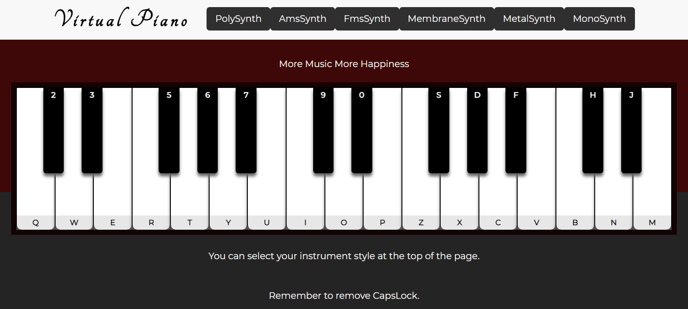
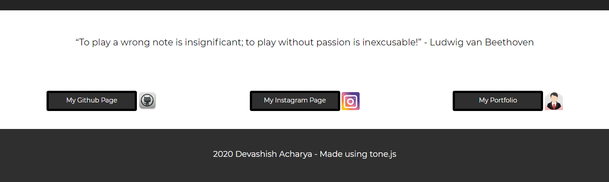

## Hello and welcome to my virtual piano.
 - Here is a link to the actual page [Virtual Piano](https://devashish-acharya.github.io/JS-Virtual-Piano/)
## Firstly, here are some pictures showing my project.

### As you can see above, they piano is available for you to play with your PC's keyboard. There are some instructions.
* Make sure your CapsLock is turned off.
* You can select a snyth type above by clicking the button.
* Remember to have fun!

### Picutre above shows some musical quotes by famous people that changes over time. Just a bit of inspiration.
The sound is created using tone.js
- You can find them at [Tone.js](https://tonejs.github.io/).
- you can download their library at [download Link](https://cdnjs.com/libraries/tone).
## You can run this project by cloning the repo 
This project was made as a part of the Tech Talent Accelerator provided by Generation UK. The course consisted of 
daily coding practice and education plus learning about soft skills reuqired to be a good developer. I started this course 6 weeks ago with no knowledge on JavaScript or CSS and some basic knowledge on HTML and will be leaving with great knew skills and knowledge and contacts with some great people!

## Here are some codes you might find interesting.

- The piano itself was made using various div tags for each key
        

            

            
More Music More Happiness

            

            

                    
                

                    
Q

                    
2

                

                

                    
W

                    
3

                
......
## And so on... This was then styled in CSS

#container {
  position: absolute;
  left: 50%;
  margin-left: -65.24rem;
  width: 130.48rem;
  height: 30rem;
  border: 1rem solid rgb(19, 3, 3);
  top: 16%;
  align-items: center;
  overflow:hidden;
  background-color:rgb(22, 9, 9) ;
}
.whitenote{
  height: 100%;
  width: 7.5575rem;
  border-radius:0rem 0rem 1rem 1rem;
  box-shadow: 0rem 0.6rem 0.6rem rgb(104, 103, 103);
  border-right: none;
  cursor: pointer;
  background: white;
  float:left;
  border: 0.06rem solid black; 
  border-bottom: none;
  position: relative;
  text-align: end;
}
.blacknote{
  position: absolute;
  height: 60%;
  width: 55%;
  border-radius: 0rem 0rem 0.6rem 0.6rem;
  box-shadow: 0rem 0.6rem 0.6rem #666;
  z-index: 1;
  background: black;
  left: 70%;
  color:white;
  font-weight: bolder;
  text-align: center;
}
## And all this was given function using tonejs and javascritp code which you can find in this repo.
### Hope you have a wonderful time using my project

